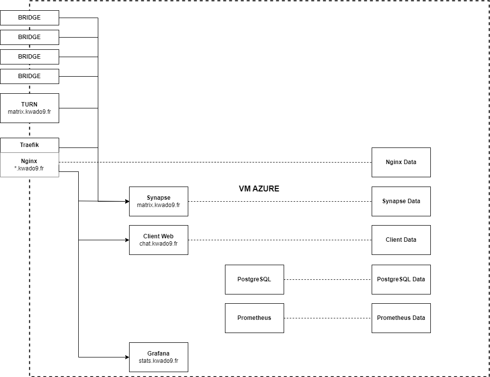

# Matrix

## Introduction

Notre application a deux composants principaux :

- une application client qui fonctionnera sur votre téléphone
- un serveur qui fonctionne sur le Cloud communiquant avec votre application

La communication avec les autres réseaux de messageries est possible grâce au réseau Matrix.

Le réseau Matrix est un réseau social décentralisé qui permet de communiquer avec d'autres réseaux de messageries comme Slack, Discord, IRC, ...

Il est ici hébergé par notre serveur.

Pour plus de détails sur Matrix voici une vidéo qui couvre le sujet : https://www.youtube.com/watch?v=wSyr8u6dvV0

## Utilisation

Notre projet utilise le repository [matrix-docker-ansible-deploy](https://github.com/spantaleev/matrix-docker-ansible-deploy/) pour déployer l'infrastructure nécessaire au bon fonctionnement de notre application.

Les instructions pour l'installation complète du serveur sont disponibles dans l'onglet [docs](https://github.com/aym00n-djrak/Kwado9/tree/main/matrix/docs)

Vous pouvez également consulter les instructions pour une installation locale du serveur pour tester l'application sans frais. Il y a cependant de nombreuses limitations à cette installation. Pour plus de détails, voir l'onglet [localhost](https://github.com/aym00n-djrak/Kwado9/tree/main/matrix/localhost)

Les modèles Azure sont disponibles dans le répertoire [modeles-azure](https://github.com/aym00n-djrak/Kwado9/tree/main/matrix/modeles-azure)

Les exemples de fichiers de configuration pour le serveur sont disponibles dans le répertoire [src](https://github.com/aym00n-djrak/Kwado9/tree/main/matrix/src)

## Schéma de l'infrastructure

## Liens utiles
- [Synapse Guide](https://matrix.org/docs/guides)
- [Matrix Guide](https://matrix-org.github.io/synapse/latest/welcome_and_overview.html)
- [matrix-docker-ansible-doc](https://github.com/spantaleev/matrix-docker-ansible-deploy/tree/master/docs)

## Auteur

Enzo GALLOS
