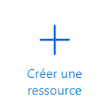

# VPS Azure

Nous avons choisit Azure comme serveur distant car il est facile d'accès et permet de réaliser notre serveur gratuitement pendant la période de test.

Si vous souhaitez utiliser notre projet sur le long terme, je vous conseille vivement d'étudier les offres concurrentes qui peuvent être plus intéressantes. On peut citer par exemple :   AWS, Oracle Cloud, Google Cloud, DigitalOcean, OVH, Linode.

## Créez votre compte

- [Compte étudiant](https://azure.microsoft.com/en-us/free/students/) offre 100$ de crédits disponibles pendant 1 an (sans cb).
- [Compte d'essai gratuit](https://azure.microsoft.com/en-us/free/) offre 200$ de crédits disponibles pendant 1 mois (avec cb).

Puis connectez vous à votre [portail Azure](https://portal.azure.com/)

## Créez votre VPS

Dans le portail, créez une ressource en appuyant sur [créer une ressource](https://portal.azure.com/#create/hub) :




Puis cliquer sur [Ubuntu Server 22.04 LTS](https://portal.azure.com/#create/canonical.0001-com-ubuntu-server-jammy22_04-lts-gen2)


Puis sélectionner l'abonnement correspondant à l'offre utilisée pour la création de votre profil, et créez un nouveau groupe de ressource.  

Vous pouvez ensuite suivre les captures d'écran si-dessous pour configurer votre serveur, pensez à copier votre **nom d'utilisateur** et **mot de passe** SSH.

//SCREENSHOTS


Les onglets Monitoring, Paramètres avancés et étiquettes n'ont pas besoin d'être modifiés, vous pouvez maintenant directement cliquer sur vérifier + créer.

Vérifiez toutes les informations rentrées, puis cliquez sur créer.

Une fois le serveur créé, vous accédez normalement à la vue d'ensemble du serveur. Pensez à notez l'**adresse IP publique** de celui-ci.

Vous pouvez accéder à cette page à tout moment à partir du portail Azure en cliquant sur le nom du serveur dans la section ressources.

## Connexion au VPS et vérification de la configuration

Nous allons maintenant nous connecter au serveur Azure via SSH, vérifier que python3 est installé et vérifier l'accès aux droits root :

1. Ouvrez un Windows PowerShell

2. connectez vous en SSH au serveur Azure :

   remplacez "user" par le nom d'utilisateur créé précédemment et 1.2.3.4 par l'IP **publique** de votre serveur Azure.

   ```powershell
   ssh user@1.2.3.4
   ```

   entrez ensuite le mot de passe SSH entré précédemment.

   Vous êtes maintenant connecté en ligne de commande sur votre serveur.

3. Testez l'accès aux droits root avec la commande suivante :

   ```bash
   sudo id
   ```

   la ligne suivante doit s'afficher sur le terminal

   ```bash
   uid=0(root) gid=0(root) groups=0(root)
   ```

4. Testez ensuite Python3 en entrant la commande suivante dans le terminal :

   ```bash
   python3
   ```

   Des lignes similaires aux lignes suivantes doivent s'afficher sur le terminal

   ```bash
   Python 3.10.6 (main, Nov 14 2022, 16:10:14) [GCC 11.3.0] on linux
   Type "help", "copyright", "credits" or "license" for more information.
   >>>
   ```

   Vous pouvez maintenant quitter python en entrant la commande ```exit()```

 5. Fermez votre connexion SSH en entrant la commande ```exit```

    Vous pouvez ensuite fermer votre PowerShell et passer à l'étape suivante

    