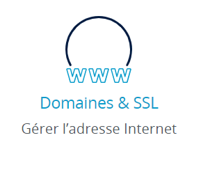
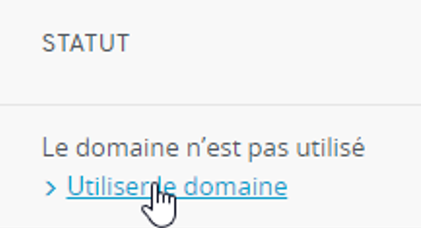
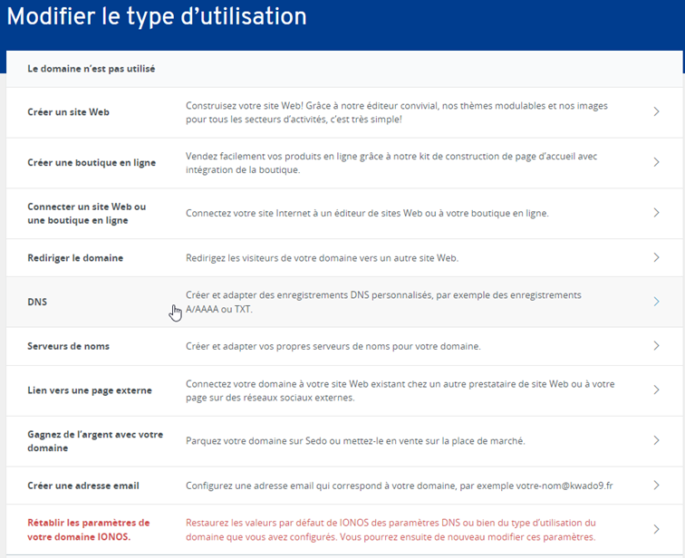

# Domaine et DNS

Nous avons choisi de commander notre nom de domaine sur [ionos](https://www.ionos.fr/) car il est seulement à 1€20 la première année. Il est possible d'utiliser un autre fournisseur de nom de domaine, 
l'interface de gestion de DNS sera différente mais le principe reste le même.

## Commande du nom de domaine

Pour commander votre nom de domaine, il vous suffit de vous rendre sur [ionos](https://www.ionos.fr/domaine/noms-de-domaine) et de choisir le nom de domaine que vous souhaitez.

## Configuration du DNS

Pour configurer le DNS de votre nom de domaine, connectez vous sur le votre compte pour accéder à votre espace client

Puis depuis votre "home" cliquez sur "Domaines et SSL".




Puis sur "utiliser le domaine".




Puis sur "DNS".




Vous êtes maintenant sur le menu de configuration du DNS, il vous suffit de cliquer sur "Ajouter un enregistrement" et de remplir les champs suivants:

(remplacez 'exemple.fr' par votre nom de domaine et '1.2.3.4' par l'adresse IP publique de votre serveur)

| TYPE  | Nom D'HÔTE             | VALEUR      | SERVICE |
|-------|------------------------|-------------|---------|
| A     | @                      |1.2.3.4      | -       |
| A     | matrix                 |1.2.3.4      | -       |
|CNAME  | element                |exemple.fr   | -       |
|CNAME  | stats                  |exemple.fr   | -       |

Le premier enregistrement pointera vers votre conteneur Nginx, le second vers votre conteneur Matrix, le troisième vers le conteneur Element et le dernier vers votre conteneur Grafana.

Votre serveur Azure ne dispose pas d'adresse IPv6, il faut donc supprimer les enregistrements AAAA en cliquant sur la poubelle à droite de ses enregistrements.

## Test de votre configuration

Pour tester votre configuration, il vous suffit de taper les commandes suivantes dans un terminal powershell:

(en remplaçant 'exemple.fr' par votre nom de domaine)

```powershell
nslookup exemple.fr
nslookup matrix.exemple.fr
nslookup element.exemple.fr
nslookup stats.exemple.fr
```

Vous devriez obtenir les résultats suivants pour les deux premières commandes:

(avec votre adresse IP à la place de '1.2.3.4' et votre nom de domaine à la place de 'exemple.fr')

```powershell
Server:  UnKnown
Address:  192.168.0.254

Non-authoritative answer:
Name:    exemple.fr
Address: 1.2.3.4
```

Vous devriez obtenir les résultats suivants pour les deux dernières commandes:

```powershell
Server:  UnKnown
Address:  192.168.0.254

Non-authoritative answer:
Name:    exemple.fr
Address: 1.2.3.4
Aliases:  element.exemple.fr
```

```powershell
Server:  UnKnown
Address:  192.168.0.254

Non-authoritative answer:
Name:    exemple.fr
Address: 1.2.3.4
Aliases:  stats.exemple.fr
```

Si vous obtenez ces résultats, votre configuration est correcte, vous pouvez donc passer à l'étape suivante.