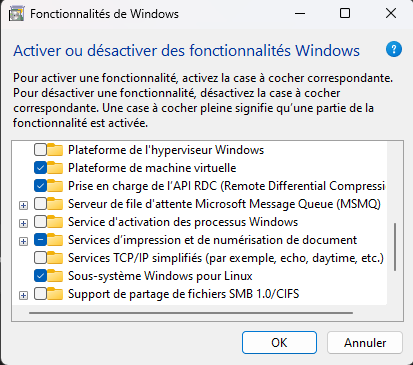
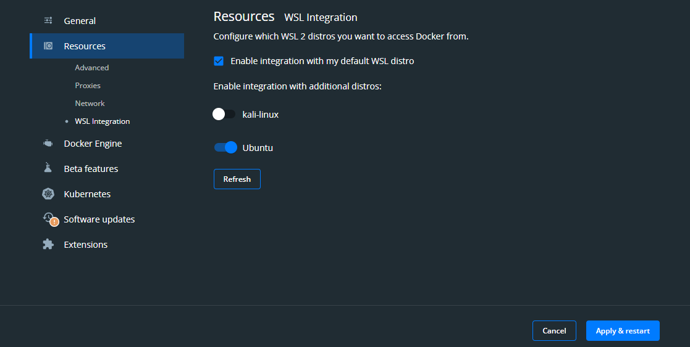

# Configuration des outils nécessaire sur Windows

Afin de rendre la configuration la plus simple et la plus sécurisée possible, nous avons choisi d'utiliser Docker et Ansible pour la configuration de notre serveur. 

Ansible permet d'installer et de configurer automatiquement les différents services que nous allons utiliser sur notre serveur à partir de fichiers de configuration.

Malheureusement, Ansible ne fonctionne pas nativement sur Windows. C'est pourquoi nous allons utiliser Docker Desktop à travers WSL (Windows Subsystem for Linux) pour pouvoir utiliser Ansible sur Windows. 

WSL nous permettra aussi d'utiliser les outils linux nécessaires à la configuration de notre serveur comme Git, pwgen, etc.

## Installation de WSL et Docker Desktop

1. Ouvrez le menu démarrer et tapez "Activer ou désactiver des fonctionnalités windows" puis cliquez sur le résultat correspondant


2. Cochez les cases suivantes :
  - Platefome de machine virtuelle
  - Sous-système Windows pour Linux



Cliquez sur OK pour valider, puis redémarrez votre ordinateur.

3. Sur le microsoft store :
  - Installez [WSL](https://www.microsoft.com/store/productId/9P9TQF7MRM4R)
  - Installez [Ubuntu](https://www.microsoft.com/store/productId/9PN20MSR04DW)

Vous pouvez maintenant ouvrir Ubuntu depuis le menu démarrer.


4. Installez [Docker Desktop](https://www.docker.com/products/docker-desktop/)

5. Votre ordinateur va redémarrer pour pouvoir finir l'installation de Docker Desktop.

6. Pour pouvoir utiliser Docker Desktop à travers Ubuntu, il faut activer l'intégration de WSL dans Docker Desktop. Pour cela, ouvrez Docker Desktop, cliquez sur les paramètres, puis sur ressources. Puis dans l'onglet WSL Integration, activez Ubuntu et cliquez sur Apply and restart.



Vous pouvez maintenant utiliser Docker Desktop à travers Ubuntu.

## Installation des autres outils

Nous allons maintenant installer les autres outils nécessaires à la configuration de notre serveur. 
- Git sera utilisé pour récupérer les fichiers de configuration d'Ansible
- Pwgen sera utilisé pour générer des mots de passe aléatoires 
- Visual Studio Code sera utilisé pour éditer les fichiers de configuration d'Ansible.

1. Ouvrez Ubuntu depuis le menu démarrer.

2. Installez git et pwgen en tapant les commandes suivantes dans le terminal d'Ubuntu :

```bash
sudo apt update
sudo apt upgrade -y
sudo apt install git pwgen -y
```

3. Sur Windows, installer [Visual Studio Code](https://code.visualstudio.com/)

## Configuration SSH

Ansible utilise SSH pour se connecter aux serveurs à configurer. Pour pouvoir utiliser Ansible depuis Ubuntu, nous devons utiliser une clé SSH. Nous allons donc remplacer l'authentification par mot de passe par l'authentification par clé SSH.

1. Ouvrez Ubuntu depuis le menu démarrer.

2. Générez une clé SSH en tapant la commande suivante dans le terminal d'Ubuntu :

Appuyez sur Entrée à chaque question pour appliquer les valeurs par défaut. (n'entrez pas de passphrase)

```bash
ssh-keygen -t rsa -b 2048
```

Vérifiez que la clé a bien été générée en tapant la commande suivante :

```bash
ls -al ~/.ssh
```

Vous devriez voir une clé nommée `id_rsa` et une clé nommée `id_rsa.pub`.

Remplacez `user` par votre nom d'utilisateur et `1.2.3.4` par l'adresse IP de votre serveur dans les commandes suivantes.

3. Copiez la clé publique sur le serveur en tapant la commande suivante :

```bash
scp ~/.ssh/id_rsa.pub user@1.2.3.4:
```

4. Connectez-vous au serveur en tapant la commande suivante :

```bash
ssh user@1.2.3.4
```

5. Ajoutez la clé publique à la liste des clés autorisées en tapant la commande suivante :

```bash
cat id_rsa.pub >> ~/.ssh/authorized_keys
```

6. Editez le fichier de configuration SSH en tapant la commande suivante :

```bash
sudo nano /etc/ssh/sshd_config
```

Vérifiez que les lignes suivantes sont présentes et qu'elles sont correctes :

```bash
PubkeyAuthentication yes
RSAAuthentication yes
```

Si ce n'est pas le cas, ajoutez les lignes manquantes et modifiez les lignes incorrectes. Sauvegardez et quittez le fichier en appuyant sur `Ctrl + X`, puis `Y` puis `Entrée`.

7. Redémarrez le service SSH en tapant la commande suivante :

```bash
sudo service ssh restart
```

8. Déconnectez-vous du serveur en tapant la commande suivante :

```bash
exit
```

9. Testez la connexion SSH en tapant la commande suivante :

```bash
ssh user@1.2.3.4
```

Vous devriez voir le message suivant :

```bash
Welcome to Ubuntu 22.04.1 LTS (GNU/Linux 5.15.0-1031-azure x86_64)

 * Documentation:  https://help.ubuntu.com
 * Management:     https://landscape.canonical.com
 * Support:        https://ubuntu.com/advantage

  System information as of Fri Feb 10 13:14:52 UTC 2023

  System load:  0.0                Users logged in:                  0
  Usage of /:   25.9% of 28.89GB   IPv4 address for br-20d24e764b41: 
  Memory usage: 36%                IPv4 address for br-ca6d16b270d6: 
  Swap usage:   0%                 IPv4 address for docker0:         
  Processes:    246                IPv4 address for eth0:            

11 updates can be applied immediately.
To see these additional updates run: apt list --upgradable


*** System restart required ***
Last login: Thu Feb  9 10:11:16 2023 from 
```

La configuration de votre Windows est terminée. Vous pouvez maintenant passer à l'étape suivante.